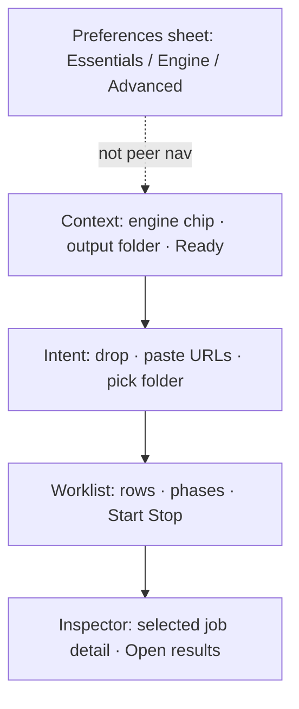
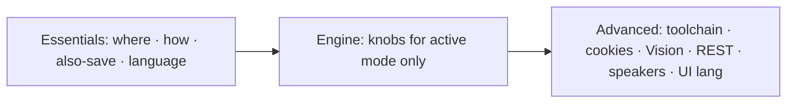
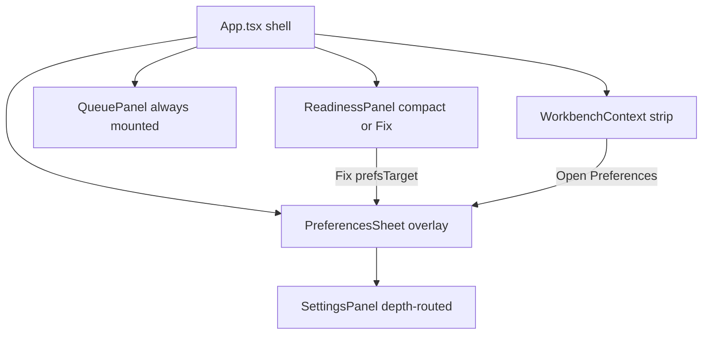

# UX Workbench Redesign - Plan

## Goal Capsule

| Field | Value |
| --- | --- |
| **Objective** | Redesign the desktop UX so v2t feels like a batch-first workbench: capture → worklist → result, with Preferences demoted to a progressive sheet. |
| **Product authority** | Product Contract below (unchanged from brainstorm). |
| **Primary actor** | Batch researcher (many sources, unattended run). Defaults stay persona-neutral. |
| **Execution** | `code` (Tauri desktop UI). |
| **Open blockers** | None. |
| **Stop if** | Implementation invents new transcription modes, API surface, or pipeline behavior beyond existing product capabilities. |
| **Product Contract preservation** | Product Contract unchanged. |

---

## Product Contract

### Summary

Rebuild the main experience around one composition: put media in, run a worklist, open durable text out.
Preferences become a three-depth sheet (Essentials / Engine / Advanced), not a peer destination to Work.
Hot path favors batch paste and sticky Start/Stop; defaults do not force engine, VTT, or meeting-oriented packs.

### Problem Frame

The product already spans many capabilities (engines, output siblings, toolchain, REST, vision).
When those capabilities compete for equal visual weight with the queue, every session pays a tax: the user must re-find “where do I drop things” and “am I ready” among knobs they rarely change.
Batch users especially need add-many → Start → leave → folder of `.txt` without opening Preferences.
A greenfield IA fixes gravity: frequency drives placement; rare power tools stay closed until needed.

### Key Decisions

- **Batch-first chrome, neutral defaults.** Sticky Start/Stop and equally loud paste-URLs live on the home path. Default Output pack is `.txt` only; Local/Cloud/Browser are not pushed on first launch; VTT/media/speakers stay off until chosen.
- **Workbench over settings dashboard.** Preferences open as a sheet/drawer. The main window is never a settings form with a queue attached.
- **Mode-filtered Engine depth.** Essentials always show mode. Engine depth shows only knobs for the active transcription mode.
- **Output pack as one object.** Plain transcript plus optional siblings (WebVTT, SRT, saved audio/video) grouped under “Also save…”, not scattered near model download or unrelated toggles.
- **Readiness before knobs.** Missing ffmpeg / yt-dlp / model surfaces as an amber strip with a Fix action that opens only the broken dependency.

### Actors

- A1. Desktop operator — adds sources, starts/stops queue, opens results.
- A2. Returning power user — rarely opens Preferences; relies on last engine + last output folder.
- A3. Integrator — enables local REST API from Advanced; does not need those controls on the home path.
- A4. External automation (via local API) — out of UI redesign scope except that Advanced must remain discoverable.

### Key Flows

- F1. Unattended batch
  - **Trigger:** Operator pastes many URLs (or adds files/folder) and presses Start.
  - **Actors:** A1
  - **Steps:** Sources land in worklist → Start processes sequentially → operator leaves → later opens output folder of `.txt` (and any opted siblings).
  - **Outcome:** No modal traps; Stop remains available; completed rows keep Open affordances.
  - **Covered by:** R1, R2, R5, R8

- F2. Returning ready session
  - **Trigger:** App opens with prior successful setup.
  - **Actors:** A2
  - **Steps:** Operator sees Ready + last engine + last output folder → drops/pastes → Start — without opening Preferences.
  - **Outcome:** Happy path completes with zero preference navigation.
  - **Covered by:** R1, R3, R6

- F3. Fix broken readiness
  - **Trigger:** Amber Ready (missing tool or model).
  - **Actors:** A1
  - **Steps:** Strip explains what is missing → Fix opens only that dependency surface → after fix, Ready returns green.
  - **Outcome:** Operator is not forced through Advanced for unrelated paths.
  - **Covered by:** R6, R10

- F4. Opt into timed output
  - **Trigger:** Operator wants `.vtt` (and optionally speaker labels) for agent handoff.
  - **Actors:** A1, A2
  - **Steps:** Open Preferences → Essentials Output pack → enable WebVTT (speakers under Advanced) → run job → Open reveals `.txt` and `.vtt`.
  - **Outcome:** Timed export is one intentional choice, never a silent default.
  - **Covered by:** R4, R7, AE3

### Visualizations

Main window gravity (structural regions, not pixel layout):



Preference depths:



### Requirements

**Main composition**

- R1. The primary window is a single workbench composition with four regions: Context (engine, output path, Ready), Intent (drop / paste / pick), Worklist (jobs + Start/Stop), and Inspector (selected-job detail, collapsed when idle).
- R2. Preferences are opened as a secondary sheet/drawer and are not an equal peer navigation destination to the workbench.
- R3. Empty worklist state teaches three capture methods with equal weight: drop files, paste URLs, pick folder — without researcher-only or meeting-only copy.

**Batch and results**

- R4. Output is presented as an Output pack: always plain `.txt`; optional siblings (WebVTT, SRT when applicable, saved audio, saved video) grouped as “Also save…”.
- R5. Start and Stop are sticky and reachable in one click from the worklist while jobs exist or are running.
- R6. Context always shows the active transcription mode, the current output folder (or clear unset state), and Ready/amber status.
- R7. Default preferences after install or reset: Output pack = `.txt` only; WebVTT, SRT keep, retained media, and speaker labels off; no forced Local or Cloud recommendation on first launch beyond whatever engine is already the product default.
- R8. Worklist rows expose phase name, progress when known, terminal Open (or equivalent) for successful outputs, and clear error entry into the Inspector.

**Preferences depths**

- R9. Preferences have three depths: Essentials (output, mode, language, Output pack, YouTube subtitle shortcut, delete-temp-audio), Engine (only fields for the active mode), Advanced (binary paths, JS runtimes, cookies-from-browser, recursive folders, Vision/OCR, local REST API, speaker labels, UI language).
- R10. When Ready is amber, Fix navigates to the minimal surface that resolves the missing dependency and does not open the full Advanced tree by default.
- R11. Changing transcription mode immediately refilters Engine depth to that mode’s essentials; inactive engines’ fields are hidden, not merely disabled in a long scroll.

**Interaction quality**

- R12. Adding sources and Start/Stop do not use ornamental animation; progress communication uses named phases rather than a single unexplained bar.
- R13. Errors that block timed export or platform access name the specific fix path (for example missing timestamps, or cookies-from-browser) rather than a generic failure only.
- R14. Existing product capabilities remain reachable after the redesign (all three transcription modes, subtitle fast-path, Output pack siblings, Vision, local REST API); no capability is removed solely for IA cleanup.

### Acceptance Examples

- AE1. Unattended batch without Preferences
  - **Covers:** R1, R5, R7, R8
  - **Given:** Ready is green; output folder is set; engine is whatever was last used.
  - **When:** Operator pastes 20 URLs, presses Start, and does not open Preferences.
  - **Then:** Jobs run; completed rows offer Open; output folder contains `.txt` files; no `.vtt` unless previously enabled.

- AE2. Mode-filtered Engine
  - **Covers:** R9, R11
  - **Given:** Mode is Local Whisper.
  - **When:** Operator opens Preferences → Engine.
  - **Then:** Local model/acceleration controls are visible; Cloud API base URL/key fields and Browser-only warnings are not shown in that depth.

- AE3. Neutral Output pack default
  - **Covers:** R4, R7
  - **Given:** Fresh defaults.
  - **When:** Operator runs one local file job.
  - **Then:** Only `.txt` is written unless they enabled siblings under Also save.

- AE4. Amber Fix stays narrow
  - **Covers:** R6, R10
  - **Given:** ffmpeg is missing; Ready is amber.
  - **When:** Operator chooses Fix.
  - **Then:** UI focuses the ffmpeg dependency action; unrelated Advanced REST/Vision controls are not the first screen.

- AE5. Integrator still finds API
  - **Covers:** R9, R14
  - **Given:** Operator needs local REST automation.
  - **When:** They open Preferences → Advanced.
  - **Then:** API enable, port, token, and docs affordance are present without appearing on the workbench Context strip.

### Success Criteria

- A returning batch user can complete a multi-URL run without opening Preferences.
- New users are not pushed into Local model download or VTT on first launch.
- Preference surfaces are scannable by question (Where? How? What else to keep?) rather than by implementation module.
- Offline, meeting→agents, and integrator jobs remain completable without hunting undocumented menus.
- Implementation does not invent new product capabilities or remove existing ones.

### Scope Boundaries

**In scope**

- Information architecture of main window and Preferences
- Empty/ready/amber states, worklist/inspector gravity, Output pack grouping
- Progressive disclosure rules and persona lock (batch-first chrome + neutral defaults)

**Deferred for later**

- Pixel-level visual redesign, new brand system, illustration set
- Parallel desktop queue concurrency controls (if not already productized)
- Auto-restart of interrupted API jobs and other planned API M5 items
- Onboarding content rewrite beyond readiness + empty-state teaching

**Outside this redesign’s identity**

- Changing transcription pipeline semantics, REST contract, or adding new engines
- Mobile/web client
- Replacing yt-dlp/ffmpeg/whisper with different tooling

### Dependencies / Assumptions

- Assumed: current product capabilities listed in app settings/types and docs remain the capability ceiling for v1 of this redesign.
- Assumed: “product default” transcription mode may remain whatever ships today; redesign must not add a first-run marketing push that overrides neutrality.
- Dependency: i18n catalogs must gain/adjust strings for Output pack, depths, Ready/Fix, and empty state.
- Dependency: first-run / onboardingCompleted flow must align with readiness strip rather than a long settings tour.

### Outstanding Questions

**Resolve Before Planning**

- None.

**Deferred to Planning** — resolved in Planning Contract KTDs below.

### Sources / Research

- Product capability grounding from `README.md`, `AGENTS.md`, `docs/API.md`, `src/types/settings.ts`, `CHANGELOG.md` (capability inventory only; not current UI layout).
- Session vision canvas: batch-first · neutral defaults lock (1 + 4).
- Frontend map: `src/App.tsx` (tabs Queue|Settings), `src/components/QueuePanel.tsx`, `src/components/SettingsPanel.tsx` (~8 flat sections), `src/components/ReadinessPanel.tsx`, `src/components/OnboardingWizard.tsx`, single stylesheet `src/App.css`, namespaces `common|queue|settings|readiness|onboarding`.

---

## Planning Contract

### Key Technical Decisions

- **KTD1 — Preferences as modal sheet, not peer tab.** Remove `activeTab: "queue" | "settings"` peer navigation. Reuse the existing onboarding backdrop/modal pattern (`onboarding-backdrop` / dialog role) as `PreferencesSheet`: Escape/close returns to the workbench; QueuePanel stays mounted underneath so jobs and listeners are uninterrupted. Rationale: R2 + existing overlay pattern; no new drawer library.
- **KTD2 — Context strip owns engine + output + Ready summary.** Compact strip above Intent (or replacing the always-expanded readiness bulk when complete). Engine shown as read-only chip that opens Preferences → Essentials (mode). Output path shown with truncated path + affordance to change folder (opens Essentials or inline pick). Ready/amber stays driven by existing `ReadinessPanel` logic; when incomplete, Fix passes a `prefsTarget` deep-link. Rationale: R6, F2.
- **KTD3 — SettingsPanel becomes depth-routed, not flat scroll of 8 sections.** Introduce `prefsDepth: "essentials" | "engine" | "advanced"` and optional `prefsFocus` (e.g. `ffmpeg`, `yt-dlp`, `whisper-model`, `api-server`). Essentials / Engine / Advanced segment control at top of the sheet. Field ownership follows R9 exactly. Mode change refilters Engine (R11). Save behavior unchanged (single Save). Rationale: R9–R11 without rewriting every control’s business logic.
- **KTD4 — Output pack regrouping is presentation-only.** No Rust/settings schema change for v1. Group existing toggles (`exportWebVtt`, `keepSrt`, `keepDownloadedAudio`, `keepDownloadedVideo`, `downloadedAudioFormat`) under one “Also save…” block in Essentials; move `labelSpeakers` to Advanced. Defaults already match R7 in `defaultAppSettings`. Rationale: R4, R7, R14.
- **KTD5 — Silent IA migration.** No one-time tip banner. Update e2e/testids: replace `tab-settings` with `open-preferences` / `preferences-sheet`. Keep `queue-panel`, `drop-zone`, `url-input`, `start-queue`, `stop-queue`. Rationale: batch-first; tips add noise.
- **KTD6 — Playlist / inspector.** Keep playlist subtasks in the existing nested worklist rows (`SubtaskList`). Inspector v1 = selected job row expansion for error text + open actions (selection state in QueuePanel); do not invent per-job engine overrides in this redesign. Rationale: deferred questions closed with minimal change; R8 without new override product.
- **KTD7 — Header language switcher stays.** Compact header `uiLanguage` control remains for power users; Advanced also exposes UI language per R9. Not a peer “Settings tab”. Rationale: convenience without violating workbench gravity.
- **KTD8 — Visual system.** Reuse `App.css` tokens and components; widen max-width only if Context+Intent need it (cap ~960px). No brand refresh. Rationale: scope boundary “pixel-level redesign deferred”.

### High-level design



**Deep-link map for Fix (R10):**

| Missing | prefsDepth | prefsFocus |
| --- | --- | --- |
| outputDir unset | essentials | output-dir |
| ffmpeg | advanced | ffmpeg |
| yt-dlp | advanced | yt-dlp |
| whisper-cli / model (local) | engine | whisper-model |
| api key (http) | engine | api-credentials |

### Assumptions

- Onboarding wizard remains available via header “Setup guide”; it is not the primary Preferences surface.
- REST API block gains i18n keys (stop hardcoding EN) as part of Advanced cleanup — behavior unchanged.
- R13 (specific error copy) is already largely pipeline-owned; UI work only surfaces existing messages in Inspector — no new backend error taxonomy in this plan.
- Header version/API badge stay.

### Sequencing

1. U1 shell + Preferences sheet chrome (unblocks everything)
2. U2 SettingsPanel depth routing + Output pack regroup
3. U3 Workbench Context + empty state + sticky run row
4. U4 Readiness Fix deep-links
5. U5 i18n + tests + e2e

External research skipped: strong local UI patterns; IA/layout-only redesign.

### Implementation constraints

- After TS/CSS: `npm run build` and `npm run test:run`.
- Do not change Rust settings schema unless a blocker appears (none expected).
- Preserve QueuePanel mount while sheet open.
- No TODO stubs; incomplete units are not merged as partial dead UI.

---

## Implementation Units

### U1. App shell: Preferences sheet replaces Settings tab

- **Goal:** Workbench is always the primary surface; Preferences opens as a modal sheet.
- **Requirements:** R1, R2
- **Files:** `src/App.tsx`, `src/App.css`, `src/locales/*/common.json`, `src/components/PreferencesSheet.tsx` (new), tests touching tabs
- **Patterns:** Mirror `OnboardingWizard` backdrop/dialog; keep QueuePanel mounted (same `hidden` reason as today).
- **Approach:** Remove tablist Queue|Settings. Add header/button `open-preferences`. State: `prefsOpen`, `prefsDepth`, `prefsFocus`. Render PreferencesSheet wrapping SettingsPanel. Wire previous `openSettingsTab` callers to open sheet.
- **Test scenarios:**
  - Opening Preferences shows sheet with `data-testid="preferences-sheet"`; queue panel remains in DOM.
  - Close via button/Escape hides sheet; workbench visible.
  - No `tab-settings` / `tab-queue` in DOM.
- **Verification:** Vitest App or PreferencesSheet test; `npm run build`.
- **Execution direction:** smoke-first for shell, then unit tests for open/close.

### U2. SettingsPanel: three depths + Output pack

- **Goal:** Regroup settings by R9; mode-filter Engine; Output pack in Essentials; speakers in Advanced.
- **Requirements:** R4, R7, R9, R11, R14, AE2, AE3, AE5
- **Files:** `src/components/SettingsPanel.tsx`, `src/components/SettingsPanel.test.tsx`, `src/locales/*/settings.json`
- **Patterns:** Existing section blocks and mode branches; add depth prop + segment control; hide inactive mode branches entirely in Engine.
- **Approach:** Map current sections → depths. Essentials: output dir, mode, transcription language, Output pack (VTT/SRT/audio/video/format), subtitle fast-path, deleteAudioAfter. Engine: local/browser/http fields for active mode only. Advanced: media tools paths, cookies, recursive, Vision, REST API, labelSpeakers, uiLanguage (duplicate of header ok), filename template if not Essentials — filename template fits Essentials (affects every job) → place in Essentials beside output. Scroll/focus `prefsFocus` targets via `data-prefs-focus` + `useEffect`.
- **Test scenarios:**
  - Local mode + Engine depth: local controls visible; cloud credential fields absent.
  - Switch mode to httpApi: Engine shows API fields; local model download absent.
  - Output pack toggles still persist via Save (WebVTT coupling tests updated for new labels/location).
  - Advanced shows REST API controls.
  - Speaker labels not in Essentials.
- **Verification:** `npm run test:run` (SettingsPanel); `npm run build`.

### U3. Workbench Context, Intent empty state, sticky Start/Stop

- **Goal:** Context strip + equal-weight capture teaching + sticky run controls.
- **Requirements:** R1, R3, R5, R6, R8, AE1
- **Files:** `src/components/QueuePanel.tsx`, `src/components/QueuePanel.test.tsx`, `src/components/WorkbenchContext.tsx` (new or inline in App), `src/App.css`, `src/locales/*/queue.json`, `src/locales/*/common.json`
- **Patterns:** Existing drop-zone / url-input / start-queue; JobProgressBar phases already named.
- **Approach:** Add Context row (mode label, output path, open-preferences). Rewrite empty hint to three equal affordances. Make `.queue-run-row` sticky within the panel scroll. Add `selectedJobId` for Inspector region (error detail under table when selected; idle → collapsed).
- **Test scenarios:**
  - Empty hint mentions drop, paste, and folder with equal structure (testid or role groups).
  - Start/Stop remain clickable with jobs present (existing tests still pass).
  - Context exposes mode + output (testid `workbench-context`).
- **Verification:** QueuePanel tests; build.

### U4. Readiness Fix deep-links into Preferences

- **Goal:** Amber Fix opens the minimal preference surface.
- **Requirements:** R6, R10, AE4, F3
- **Files:** `src/components/ReadinessPanel.tsx`, `src/components/ReadinessPanel.test.tsx`, `src/App.tsx`, PreferencesSheet/SettingsPanel focus hooks
- **Patterns:** Existing `onOpenSettings`; extend to `onOpenPreferences(target)`.
- **Approach:** Map incomplete checks → prefsDepth/prefsFocus. Pass through App into sheet. Auto-scroll/highlight focus target.
- **Test scenarios:**
  - Missing ffmpeg → open preferences Advanced + focus ffmpeg.
  - Local mode missing model → Engine + whisper-model.
  - Unset output → Essentials + output-dir.
- **Verification:** ReadinessPanel + integration test; build.

### U5. i18n, e2e, regression polish

- **Goal:** All new chrome strings localized; Playwright smoke matches new IA.
- **Requirements:** R14, Success Criteria
- **Files:** `src/locales/{en,uk,ru,de,es,fr,pl,pt}/{common,settings,queue,readiness}.json`, `e2e/smoke.spec.ts`, any App tests
- **Approach:** Add keys for Preferences, depths, Output pack, Context labels, empty-state triad. Translate at least en fully; mirror structure in other locales (en copy acceptable temporarily only if project already does that — prefer real translations for uk/ru/de already maintained). Update e2e: open preferences via new testid; assert drop-zone + start/stop still work.
- **Test scenarios:**
  - e2e home shows drop-zone; preferences opens; save still works.
  - i18n switch still changes visible Preferences title.
- **Verification:** `npm run test:run`; `npm run build`; `npm run e2e` when environment allows.

---

## Verification Contract

| Gate | Command | Applies |
| --- | --- | --- |
| Unit / component | `npm run test:run` | After U1–U5 |
| Typecheck / bundle | `npm run build` | After each unit that touches TS/CSS |
| E2E smoke | `npm run e2e` | After U5 (or end) |
| Rust | not required | No schema/pipeline changes expected |

---

## Definition of Done

**Global**

- Peer Settings tab gone; Preferences sheet works; workbench always primary.
- Preferences depths match R9; Engine mode-filtered.
- Output pack grouped; defaults still `.txt`-only.
- Fix deep-links amber issues to the right depth.
- Tests and e2e updated; `npm run build` + `npm run test:run` green.
- No new product capabilities; no removed engines/API/vision.

**Per unit**

- U1: sheet open/close + QueuePanel mounted.
- U2: depth tests + Output pack + speakers Advanced.
- U3: context + empty triad + sticky run + selection inspector.
- U4: Fix target mapping tested.
- U5: locales + e2e green or explicitly blocked with environment note.
```
